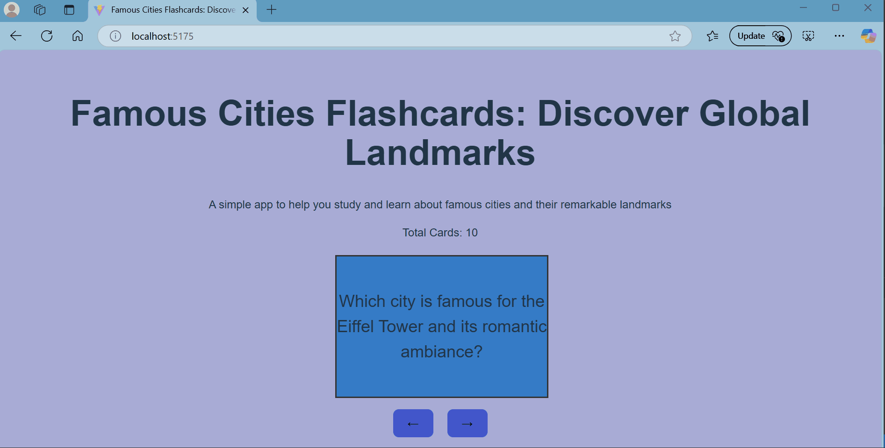

# Web Development Project 3 - Flashcards App

Submitted by: **Jafrul Amin**

This web app is a simple flashcard application designed to help users study and review famous cities and their remarkable landmarks. It displays a single card at a time, allowing the user to flip the card by clicking on it to view the answer, and navigate through the flashcards using forward and backward arrow buttons.

Time spent: **7** hours spent in total

## Required Features

The following **required** functionality is completed:

- [x] **The user can enter their guess in a box before seeing the flipside of the card**
- [x] **Clicking on a submit button shows visual feedback about whether the answer was correct or incorrect**
- [x] **A back button displayed on the card can be used to return to the previous card in a set sequence**
- [x] **A next button displayed on the card can be used to navigate to the next card in a set sequence**

The following **additional** features are implemented:

- [x] A flip animation is added when clicking on the card, enhancing the user experience by smoothly revealing the answer.
- [x] A shuffle button is available to randomize the order of the cards.
- [x] Streak tracking is implemented, displaying both the current streak and the longest streak of correct answers.

## Video Walkthrough

Here's a walkthrough of the implemented required features:

<!-- Replace this with whatever GIF tool you used! -->

GIF created with ...

[ScreenToGif](https://www.screentogif.com/) for Windows

## Notes

<!-- Any additional notes can be added here -->

## License

    Copyright [2025]
    [Jafrul Amin]

    Licensed under the Apache License, Version 2.0 (the "License");
    you may not use this file except in compliance with the License.
    You may obtain a copy of the License at

        http://www.apache.org/licenses/LICENSE-2.0

    Unless required by applicable law or agreed to in writing, software
    distributed under the License is distributed on an "AS IS" BASIS,
    WITHOUT WARRANTIES OR CONDITIONS OF ANY KIND, either express or implied.
    See the License for the specific language governing permissions and
    limitations under the License.
