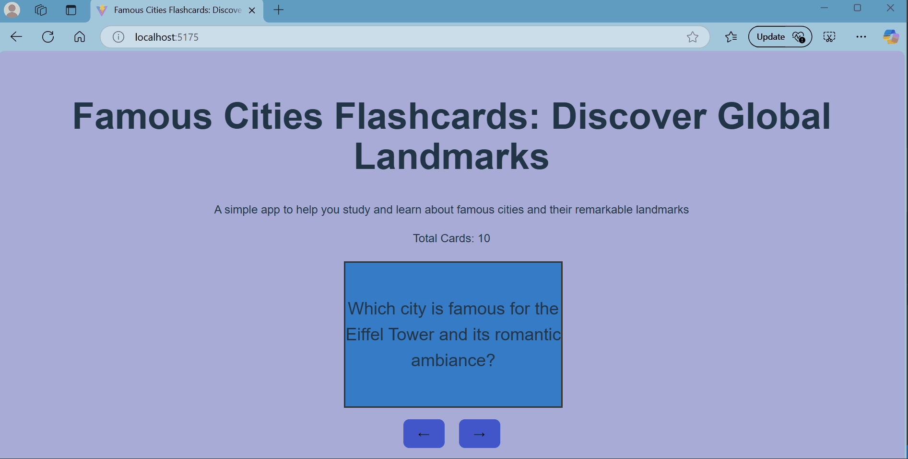

# Web Development Project 2 - Flashcards App

Submitted by: **Jafrul Amin**

This web app is a simple flashcard application designed to help users study and review about famous cities and their remarkable landmarks. It displays a single card at a time, allowing the user to flip the card to view the answer, and navigate through the flashcards using forward and backward arrows.

Time spent: **4** hours spent in total

## Required Features

The following **required** functionality is completed:

- [x] **The title of the card set and some information about it, such as a short description and the total number of cards are displayed**
- [x] **A single card at a time is displayed, only showing one of the components of the information pair**
- [x] **A list of card pairs is created**
- [x] **Clicking on the card shows the corresponding component of the information pair**
- [x] **Clicking the next button displays a new card**

The following **additional** features are implemented:

- [x] A flip animation is added when clicking on the card, enhancing the user experience by smoothly revealing the answer.
- [x] Backward and forward arrow navigation have been implemented to allow the user to review previous or upcoming cards.

## Video Walkthrough

Here's a walkthrough of implemented required features:

<!-- Replace this with whatever GIF tool you used! -->

GIF created with ...

<!-- [ScreenToGif](https://www.screentogif.com/) for Windows -->

## Notes

## License

    Copyright [2025]
    [Jafrul Amin]

    Licensed under the Apache License, Version 2.0 (the "License");
    you may not use this file except in compliance with the License.
    You may obtain a copy of the License at

        http://www.apache.org/licenses/LICENSE-2.0

    Unless required by applicable law or agreed to in writing, software
    distributed under the License is distributed on an "AS IS" BASIS,
    WITHOUT WARRANTIES OR CONDITIONS OF ANY KIND, either express or implied.
    See the License for the specific language governing permissions and
    limitations under the License.
